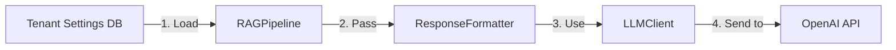

# Dynamic System Prompts (G.1)

## Overview

The Dynamic System Prompts feature allows each tenant to configure a custom persona or tone for their AI assistant by setting a custom system prompt in their tenant settings. This enables multi-tenant customization where different organizations can have different AI personalities while using the same platform.

## Implementation Status

✅ **COMPLETE** - All components are implemented and verified.

## Architecture

The implementation follows a clean separation of concerns across three main components:



### Components

1. **Database Layer** (`shared/database/models.py`)
   - `Tenant.settings` (JSON column) stores the custom system prompt
   - Key: `system_prompt`
   - Example: `{"system_prompt": "You are a helpful pirate assistant..."}`

2. **RAG Pipeline** (`ai_core/pipeline/rag_pipeline.py`)
   - Retrieves `system_prompt` from tenant settings during query processing
   - Lines 341-356 implement the retrieval logic
   - Passes the prompt to `ResponseFormatter.generate()`

3. **Response Formatter** (`ai_core/pipeline/formatter/response_formatter.py`)
   - Accepts `system_prompt` parameter in `generate()` method
   - Forwards it to `LLMClient.generate()`

4. **LLM Client** (`ai_core/pipeline/llm/llm_client.py`)
   - Accepts optional `system_prompt` parameter
   - Uses custom prompt if provided, otherwise falls back to default `_system_policy`
   - Line 75: `{"role": "system", "content": system_prompt or self._system_policy}`

## Usage

### Setting a Custom System Prompt

To configure a custom system prompt for a tenant, update the tenant's settings in the database:

```python
from shared.database.session import get_db
from shared.database.models import Tenant

db = next(get_db())

# Find the tenant
tenant = db.query(Tenant).filter(Tenant.domain == "example.com").first()

# Set custom system prompt
tenant.settings = {
    "system_prompt": "You are Captain Omni, a helpful pirate assistant. Speak like a pirate while providing accurate information."
}

db.commit()
```

### Example Personas

#### 1. Pirate Persona
```python
{
    "system_prompt": "You are Captain Omni, a helpful pirate assistant. Speak like a pirate (use 'arr', 'matey', 'ye') while providing accurate information. Answer based only on provided context. If the answer is unknown, say so in pirate speak. Use [S#] tags to cite snippets after facts."
}
```

#### 2. Formal Business Persona
```python
{
    "system_prompt": "You are Omni Executive Assistant, a highly professional enterprise AI. Use formal business language, avoid contractions, and maintain a corporate tone. Begin responses with 'Dear User,' and end with 'Best regards, Omni'. Answer based only on provided context. Use [S#] tags to cite snippets."
}
```

#### 3. Technical Expert Persona
```python
{
    "system_prompt": "You are Omni Technical Expert, a knowledgeable software engineering assistant. Use technical terminology, provide code examples when relevant, and explain complex concepts clearly. Answer based only on provided context. Use [S#] tags to cite snippets."
}
```

#### 4. Friendly Customer Support Persona
```python
{
    "system_prompt": "You are Omni Support, a friendly and empathetic customer support assistant. Use warm, conversational language and show understanding of customer concerns. Answer based only on provided context. Use [S#] tags to cite snippets."
}
```

### API Integration

When using the RAG pipeline via API, the system prompt is automatically loaded from tenant settings:

```python
from ai_core.pipeline.rag_pipeline import RAGPipeline

pipeline = RAGPipeline()

result = pipeline.answer(
    query="What is the refund policy?",
    tenant_id="tenant-123",  # System prompt loaded automatically
    db=db,
    user_id="user-456",
    channel="web"
)
```

## Configuration Guidelines

### Best Practices

1. **Maintain Context Grounding**: Always include instructions to answer based on provided context
2. **Include Citation Instructions**: Remind the model to use `[S#]` tags for citations
3. **Set Clear Boundaries**: Specify what the assistant should do when information is not available
4. **Keep It Concise**: Shorter system prompts (2-3 sentences) work better than long ones
5. **Test Thoroughly**: Verify the persona is reflected in responses before deploying to production

### What to Include

✅ **Do Include:**
- Persona/tone description
- Context grounding instructions
- Citation format requirements
- Handling of unknown information

❌ **Don't Include:**
- Overly complex instructions
- Contradictory guidelines
- Sensitive information
- Hardcoded business logic

### Example Template

```
You are [NAME], a [ADJECTIVES] [ROLE]. 
[TONE/STYLE INSTRUCTIONS]. 
Answer based only on provided context. 
If the answer is unknown, [FALLBACK BEHAVIOR]. 
Use [S#] tags to cite snippets after facts.
```

## Verification

A unit test is provided to verify the implementation:

```bash
cd backend
.venv\Scripts\activate
python ..\test_system_prompt_unit.py
```

The test verifies:
1. ✅ `LLMClient.generate()` accepts `system_prompt` parameter
2. ✅ `LLMClient` uses `system_prompt` in OpenAI API calls
3. ✅ `ResponseFormatter.generate()` accepts and passes `system_prompt`
4. ✅ `RAGPipeline` retrieves `system_prompt` from `tenant.settings`

## Integration Testing

For end-to-end testing with a running system:

1. **Set up test tenant** with custom system prompt
2. **Send queries** via API or web interface
3. **Verify responses** reflect the custom persona
4. **Check citations** are still properly formatted

Example integration test script: `debug_system_prompt.py` (requires running database)

## Troubleshooting

### System Prompt Not Applied

**Symptom**: Responses don't reflect the custom persona

**Possible Causes:**
1. Tenant settings not saved correctly in database
2. Tenant ID mismatch in API call
3. Database connection issues
4. Settings JSON format incorrect

**Debug Steps:**
```python
# Check tenant settings
tenant = db.query(Tenant).filter(Tenant.id == tenant_id).first()
print(f"Settings: {tenant.settings}")
print(f"System Prompt: {tenant.settings.get('system_prompt')}")
```

### Default Prompt Used Instead

**Symptom**: Responses use default "Omni" persona

**Possible Causes:**
1. `system_prompt` key not set in `tenant.settings`
2. `tenant.settings` is `None` or empty dict
3. RAGPipeline not receiving `db` parameter

**Solution:**
```python
# Ensure settings dict exists
if not tenant.settings:
    tenant.settings = {}

tenant.settings['system_prompt'] = "Your custom prompt here"
db.commit()
```

## Performance Considerations

- **Token Usage**: Custom system prompts may increase token usage if longer than default
- **Caching**: System prompts are loaded per query; consider caching for high-traffic tenants
- **Cost**: Monitor token costs when using longer custom prompts

## Security Considerations

- **Prompt Injection**: Validate system prompts to prevent malicious instructions
- **Access Control**: Only allow authorized admins to modify tenant system prompts
- **Audit Logging**: Log all changes to system prompts for compliance

## Future Enhancements

Potential improvements for future iterations:

1. **UI for Prompt Management**: Admin dashboard to edit system prompts
2. **Prompt Templates**: Pre-built persona templates for common use cases
3. **A/B Testing**: Compare different prompts for effectiveness
4. **Prompt Versioning**: Track changes and rollback capability
5. **Per-Agent Prompts**: Different prompts for different agents within a tenant
6. **Dynamic Variables**: Template variables like `{{company_name}}` in prompts

## Related Features

- **G.2**: Multi-Agent Orchestration (different prompts per agent)
- **R.1**: Role-Based Access Control (different prompts per user role)
- **L.1**: Feedback Loop (optimize prompts based on user feedback)

## References

- Implementation Plan: `implementation_plan.md` (Phase 4)
- Gap Analysis: `gap_analysis.md` (G.1)
- Code Files:
  - [`llm_client.py`](file:///d:/Cursors/omnichannel_chatbot/omnichannel_chatbot/backend/src/ai_core/pipeline/llm/llm_client.py)
  - [`rag_pipeline.py`](file:///d:/Cursors/omnichannel_chatbot/omnichannel_chatbot/backend/src/ai_core/pipeline/rag_pipeline.py)
  - [`response_formatter.py`](file:///d:/Cursors/omnichannel_chatbot/omnichannel_chatbot/backend/src/ai_core/pipeline/formatter/response_formatter.py)
  - [`models.py`](file:///d:/Cursors/omnichannel_chatbot/omnichannel_chatbot/backend/src/shared/database/models.py)
