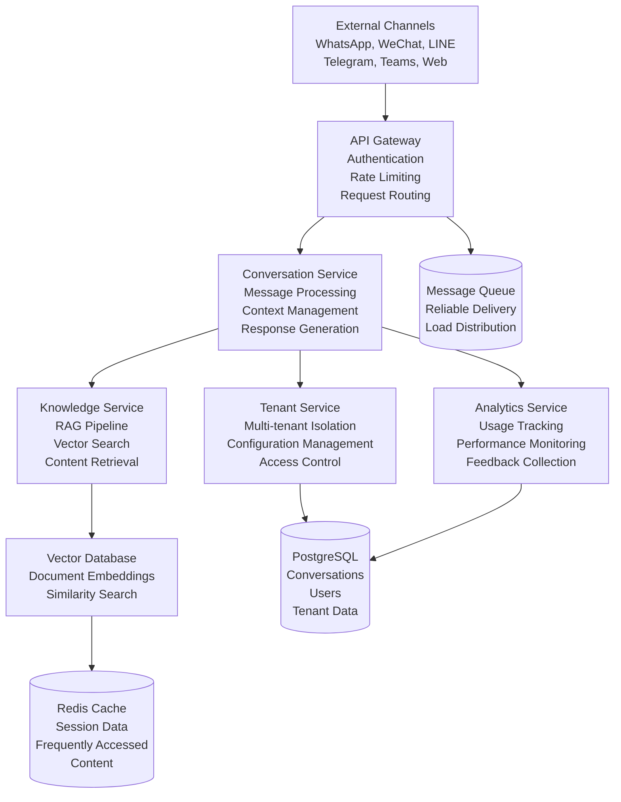
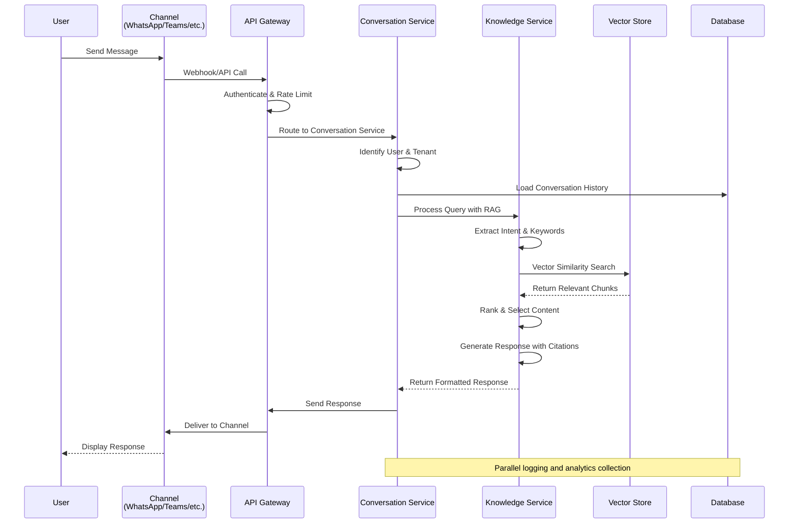

# Feature Specification: Omnichannel Enterprise RAG Chatbot Platform

**Feature Branch**: `001-specify`
**Created**: 2025-10-13
**Status**: Draft  
**Input**: User description: "/specify"

## User Scenarios & Testing *(mandatory)*

### User Story 1 - Customer Inquiry Resolution (Priority: P1)

An external customer contacts the organization through any supported channel (WhatsApp, WeChat, LINE, Telegram, Web, Teams) seeking information or assistance with products, services, or account-related matters.

**Why this priority**: This represents the core value proposition of the platform - enabling customers to get accurate, contextual assistance across all communication channels they prefer to use.

**Independent Test**: Can be fully tested by sending a customer inquiry through any single channel and verifying that the response is accurate, contextual, and sourced from verified knowledge base content.

**Acceptance Scenarios**:

1. **Given** a customer sends an inquiry about product features via WhatsApp, **When** they receive a response, **Then** the response must be accurate, contextual, and include source citations from the knowledge base.
2. **Given** a customer asks about account billing via web chat, **When** they receive assistance, **Then** the response must maintain conversation context and provide step-by-step guidance.

---

### User Story 2 - Internal Staff Knowledge Access (Priority: P1)

Internal staff members (support agents, sales representatives, technical teams) need quick access to organizational knowledge, policies, procedures, and product information to serve customers effectively.

**Why this priority**: Staff efficiency and accuracy directly impact customer satisfaction and operational costs, making this equally critical as external customer service.

**Independent Test**: Can be fully tested by having an internal user query the system for policy information and verifying they receive accurate, up-to-date responses with proper access controls.

**Acceptance Scenarios**:

1. **Given** a support agent needs policy clarification, **When** they query the internal knowledge system, **Then** they must receive accurate, current policy information with source attribution.
2. **Given** a sales representative needs product specifications, **When** they search the knowledge base, **Then** they must get comprehensive, up-to-date product details organized for easy reference.

---

### User Story 3 - Multi-Channel Conversation Continuity (Priority: P2)

Users can seamlessly continue conversations across different channels while maintaining context, history, and personalized experiences.

**Why this priority**: Modern users expect seamless experiences regardless of channel switching, improving satisfaction and reducing friction in customer interactions.

**Independent Test**: Can be fully tested by starting a conversation on one channel (e.g., WhatsApp) and continuing it on another (e.g., web chat) while verifying that context, history, and user preferences are maintained.

**Acceptance Scenarios**:

1. **Given** a customer starts a conversation on WhatsApp, **When** they switch to web chat, **Then** the conversation history and context must be preserved across the channel transition.
2. **Given** a user has established preferences in one channel, **When** they interact via another channel, **Then** their preferences and interaction style must be consistently applied.

---

### User Story 4 - Knowledge Base Management (Priority: P2)

Administrators and knowledge managers can update, organize, and maintain the knowledge base content that powers the RAG system, ensuring information accuracy and relevance.

**Why this priority**: The quality and currency of knowledge directly impacts response accuracy and user trust in the system.

**Independent Test**: Can be fully tested by having an administrator add new knowledge content and verifying that it immediately becomes available for retrieval in customer conversations.

**Acceptance Scenarios**:

1. **Given** new product information is added to the knowledge base, **When** a customer inquires about that product, **Then** the updated information must be reflected in the response.
2. **Given** knowledge content is flagged as outdated, **When** users search for that information, **Then** they must receive either updated content or clear indication that the information may be outdated.

---

### Edge Cases

- **Unsupported Language Handling**: Detect unsupported languages and respond in English with clear indication that the message was understood but responded to in English, offering escalation to human support for translation assistance
- **Message Length Limits**: Truncate extremely long messages (>4000 characters) with indication that content was shortened, provide summary of truncated content
- **RAG Retrieval Failure**: Fall back to cached responses, then offer to escalate to human support if no relevant cached information available
- **High System Load**: Implement queue-based processing with estimated wait times communicated to users, prioritize based on conversation urgency
- **External API Outages**: Use comprehensive fallback hierarchy (RAG → Cached → Human escalation → Generic error) with channel-specific offline indicators
- **Malicious Content**: Implement content filtering with automatic moderation, escalate suspicious content to human review within security protocols
- **Unauthorized Access**: Return appropriate error messages with guidance on authentication requirements, log security events for audit trails

## Requirements *(mandatory)*

### Functional Requirements

- **FR-001**: System MUST accept and process messages from WhatsApp, WeChat, LINE, Telegram, Web, and Microsoft Teams channels
- **FR-002**: System MUST implement Retrieval-Augmented Generation (RAG) to provide contextual, accurate responses based on verified knowledge sources
- **FR-003**: System MUST maintain separate knowledge bases and configurations for different tenants (organizations)
- **FR-004**: System MUST enforce role-based access control distinguishing between internal staff and external customers
- **FR-005**: System MUST preserve conversation context and history across channel switches for seamless user experiences
- **FR-006**: System MUST provide administrators with tools to update, organize, and maintain knowledge base content
- **FR-007**: System MUST log all conversations, system events, and user interactions for audit and analytics purposes
- **FR-008**: System MUST collect user feedback on response quality to continuously improve system performance
- **FR-009**: System MUST support real-time response generation for interactive conversations
- **FR-010**: System MUST handle multiple concurrent conversations per tenant without performance degradation

### Key Entities *(include if feature involves data)*

- **Tenant**: Represents an organization using the platform, containing users, knowledge bases, and configurations
- **User**: Individual interacting with the system, either as internal staff or external customer, with associated roles and preferences
- **Conversation**: A session of interaction between a user and the system, maintaining context and history across channels
- **Knowledge Base**: Collection of verified information, documents, and content that powers the RAG system for a specific tenant
- **Message**: Individual communication within a conversation, containing user input, system responses, and metadata
- **Channel**: Communication platform (WhatsApp, WeChat, etc.) through which users interact with the system

## Success Criteria *(mandatory)*

### Measurable Outcomes

- **SC-001**: 95% of customer inquiries receive accurate, contextual responses within 2 seconds for cached queries
- **SC-002**: Users can seamlessly continue conversations across different channels with 100% context preservation
- **SC-003**: Internal staff resolve customer inquiries 40% faster using the knowledge system compared to traditional methods (measured by average time-to-resolution tracking before and after system deployment)
- **SC-004**: Customer satisfaction scores improve by 25% within the first six months of deployment
- **SC-005**: System handles up to 10,000 concurrent conversations per tenant without performance degradation
- **SC-006**: Knowledge base updates become available in customer responses within 5 minutes of publication
- **SC-007**: 90% of users successfully complete their intended tasks on first interaction attempt

## System Overview

The Omnichannel Enterprise RAG Chatbot Platform is a comprehensive conversational AI solution designed to serve both internal staff and external customers across multiple communication channels. The platform leverages Retrieval-Augmented Generation (RAG) technology to provide accurate, contextual responses based on verified organizational knowledge.

**Project Scope**: Multi-tenant platform supporting conversational AI across WhatsApp, WeChat, LINE, Telegram, Web interfaces, and Microsoft Teams, with separate operational modes for internal staff knowledge access and external customer service.

**Goals**: Deliver instant, accurate responses to user inquiries while maintaining security, compliance, and scalability for enterprise deployment.

**Stakeholders**:
- **External Customers**: End users seeking product information, support, and assistance
- **Internal Staff**: Support agents, sales teams, and employees requiring quick access to organizational knowledge
- **Administrators**: IT and knowledge management teams responsible for system configuration and content management
- **Business Leaders**: Decision-makers focused on customer satisfaction, operational efficiency, and ROI

**Internal vs External Modes**:
- **External Mode**: Customer-facing chatbot providing product information, account assistance, and general support
- **Internal Mode**: Staff knowledge system offering policy access, procedural guidance, and organizational information

**Business Rationale**: Organizations face increasing customer expectations for instant, accurate responses across all communication channels. Traditional support systems struggle with information silos, inconsistent responses, and high operational costs. This platform addresses these challenges by providing a unified, intelligent system that reduces response times, improves accuracy through RAG technology, and scales to meet enterprise demands while maintaining security and compliance standards.

## Clarifications

### Session 2025-10-13

- **Q**: How should the system handle and recover from different types of failures while maintaining user experience? **A**: Comprehensive fallback hierarchy - RAG → Cached responses → Human escalation → Generic error message
- **Q**: What are the specific data retention policies and privacy handling requirements for different types of data? **A**: Enterprise-standard retention - Conversations: 90 days, Audit logs: 7 years, User data: Until account deletion + 30 days
- **Q**: What are the specific authentication mechanisms and session management requirements for internal staff versus external customers? **A**: Dual authentication - SAML/OAuth for internal staff, social login for external customers
- **Q**: How should the system handle the inherent limitations and capabilities of different communication channels? **A**: Channel-optimized features - Different feature sets optimized for each channel's strengths and limitations
- **Q**: What are the specific rate limiting and abuse prevention measures needed for different user types and usage patterns? **A**: Tiered rate limits - Different limits for internal staff (higher) vs external customers (lower) with burst capacity
- **Q**: What baseline measurement method should be used to quantify the 40% efficiency improvement for internal staff? **A**: Time-to-resolution tracking - Measure average resolution time before and after system deployment
- **Q**: What specific languages should be supported and how should the system handle unsupported languages? **A**: Expanded business set - English, Chinese, Japanese, Korean, Thai, Spanish, French, German, Portuguese, Arabic

## Functional Requirements

### Chat Ingestion
- **FR-011**: System MUST receive and parse messages from WhatsApp Business API
- **FR-012**: System MUST integrate with WeChat Official Accounts for message handling
- **FR-013**: System MUST connect to LINE Business API for conversation management
- **FR-014**: System MUST support Telegram Bot API integration
- **FR-015**: System MUST provide embeddable web chat widgets for website integration
- **FR-016**: System MUST integrate with Microsoft Teams bot framework

### RAG Processing Flow
- **FR-017**: System MUST convert incoming messages to vector embeddings for similarity search
- **FR-018**: System MUST perform hybrid retrieval combining semantic and keyword-based search
- **FR-019**: System MUST rank retrieved knowledge chunks by relevance and recency
- **FR-020**: System MUST generate contextual responses using retrieved information and conversation history
- **FR-021**: System MUST provide source citations for all information included in responses

### Role-Based Access
- **FR-022**: System MUST distinguish between internal staff and external customer access levels
- **FR-023**: System MUST restrict sensitive organizational information to authenticated internal users only
- **FR-024**: System MUST allow different knowledge base access based on user roles and departments
- **FR-025**: System MUST support hierarchical permission structures for multi-level organizations

### Logging, Analytics, and Feedback
- **FR-026**: System MUST log all conversations with timestamps, user identification, and message content
- **FR-027**: System MUST track response accuracy, user satisfaction, and conversation outcomes
- **FR-028**: System MUST collect explicit user feedback on response helpfulness and accuracy
- **FR-029**: System MUST provide analytics dashboards for conversation metrics and system performance

## Non-Functional Requirements

### Performance Targets
- **NFR-001**: System MUST respond to cached queries within 2 seconds for 95% of requests
- **NFR-002**: System MUST handle up to 10,000 concurrent conversations per tenant
- **NFR-003**: System MUST maintain knowledge base retrieval performance with millions of documents
- **NFR-004**: System MUST support real-time message processing for interactive conversations

### Security and Compliance
- **NFR-005**: System MUST encrypt all data in transit using TLS 1.3 or higher
- **NFR-006**: System MUST encrypt sensitive data at rest using AES-256 encryption
- **NFR-007**: System MUST implement comprehensive audit logging for all user interactions
- **NFR-008**: System MUST comply with SOC2 Type II security standards
- **NFR-009**: System MUST support GDPR compliance for personal data handling
- **NFR-010**: System MUST enable PDPA compliance for operations in relevant jurisdictions

### Data Segregation
- **NFR-011**: System MUST maintain complete data isolation between tenants
- **NFR-012**: System MUST prevent cross-tenant data access or leakage
- **NFR-013**: System MUST support tenant-specific configurations and customizations
- **NFR-014**: System MUST enable secure data export for compliance and migration purposes

### Multilingual Support
- **NFR-015**: System MUST support 10 major business languages: English, Chinese (Simplified & Traditional), Japanese, Korean, Thai, Spanish, French, German, Portuguese, and Arabic
- **NFR-016**: System MUST maintain conversation context across language switches within supported languages
- **NFR-017**: System MUST provide culturally appropriate responses for different markets (date formats, currency symbols, business etiquette)
- **NFR-018**: System MUST handle mixed-language conversations appropriately and detect when to respond in English for unsupported languages

## System Architecture

### High-Level Overview

The platform follows a microservices architecture designed for horizontal scalability, multi-tenancy, and omnichannel support. The system is divided into logical subsystems that handle specific responsibilities while maintaining loose coupling and high cohesion.

```
┌─────────────────────────────────────────────────────────────────────────┐
│                          External Channels                              │
│  ┌─────────────┐  ┌─────────────┐  ┌─────────────┐  ┌─────────────┐   │
│  │  WhatsApp   │  │  WeChat     │  │   LINE      │  │  Telegram   │   │
│  │   Business  │  │ Official    │  │  Business   │  │   Bot API   │   │
│  │    API      │  │  Accounts   │  │    API      │  │             │   │
│  └─────────────┘  └─────────────┘  └─────────────┘  └─────────────┘   │
└─────────────────────────────────────────────────────────────────────────┘
                                 │
                      ┌──────────▼──────────┐
                      │   API Gateway       │
                      │ • Rate limiting     │
                      │ • Authentication    │
                      │ • Request routing   │
                      └──────────┬──────────┘
                                 │
┌────────────────────────────────▼──────────────────────────────────────┐
│                        Service Layer                                   │
├────────────────────────────────────────────────────────────────────────┤
│  ┌─────────────┐  ┌─────────────┐  ┌─────────────┐  ┌─────────────┐   │
│  │ Conversation│  │  Knowledge  │  │   Tenant    │  │ Analytics  │   │
│  │  Service    │  │  Service    │  │  Service    │  │  Service   │   │
│  │ • Context   │  │ • RAG       │  │ • Multi-    │  │ • Metrics  │   │
│  │ • History   │  │ • Vector    │  │   tenant    │  │ • Logging  │   │
│  └─────────────┘  └─────────────┘  └─────────────┘  └─────────────┘   │
└────────────────────────────────────────────────────────────────────────┘
                                 │
                      ┌──────────▼──────────┐
                      │ Data Storage Layer  │
                      │ • PostgreSQL        │
                      │ • Redis Cache       │
                      │ • Vector Database   │
                      └─────────────────────┘
```

### Component Diagram



### Subsystems

**`/gateway` - API Gateway**:
- Centralized entry point for all requests
- Authentication and authorization
- Rate limiting and DDoS protection
- Request routing to appropriate services

**`/ai_core` - AI Core Services**:
- Conversation management and context
- RAG pipeline orchestration
- Response generation and formatting
- Multi-channel message handling

**`/frontend` - User Interfaces**:
- Web chat widgets and embeds
- Administrative dashboards
- Real-time conversation monitoring
- Analytics and reporting interfaces

**`/db` - Data Layer**:
- Multi-tenant database design
- Vector storage for embeddings
- Session and cache management
- Audit log storage

**`/infra` - Infrastructure**:
- Container orchestration
- Service mesh configuration
- Infrastructure as Code
- Deployment automation

**`/monitoring` - Observability**:
- Metrics collection and alerting
- Log aggregation and analysis
- Performance monitoring
- Error tracking and debugging

## Data Flow

### Step-by-Step Message Path



### Detailed Flow Description

1. **Message Reception**: User sends message through external channel (WhatsApp, Teams, etc.)
2. **API Gateway Processing**: Validates authentication, applies rate limiting, routes to appropriate service
3. **User & Tenant Identification**: Determines user identity and tenant context from message metadata
4. **Conversation Context Loading**: Retrieves recent conversation history and user preferences
5. **Intent Analysis**: Extracts user intent and key information from message content
6. **Knowledge Retrieval**: Performs hybrid search across tenant's knowledge base using vector similarity
7. **Content Ranking**: Scores and selects most relevant knowledge chunks based on relevance and recency
8. **Response Generation**: Creates contextual response using retrieved information and conversation history
9. **Citation Addition**: Includes source references for transparency and verification
10. **Response Delivery**: Routes response back through appropriate channel with formatting
11. **Logging & Analytics**: Records interaction data for performance monitoring and improvement

## Tech Stack & Rationale

### Core Technology Choices

| Component | Technology | Rationale |
|-----------|------------|-----------|
| **API Gateway** | FastAPI + Uvicorn | High-performance async Python framework with automatic OpenAPI documentation |
| **RAG Core** | LangChain + OpenAI/Azure OpenAI | Industry-standard RAG framework with enterprise LLM integration |
| **Channel Webhooks** | NestJS + Express | TypeScript-based framework for reliable webhook handling and type safety |
| **Web UI** | Next.js 14 + React | Modern React framework with SSR for SEO and performance |
| **Database** | PostgreSQL 15 | ACID-compliant relational database with excellent multi-tenant support |
| **Cache** | Redis Cluster | High-performance in-memory store for sessions and frequently accessed data |
| **Vector DB** | Qdrant/Pinecone | Specialized vector database for semantic search at scale |
| **Message Queue** | RabbitMQ | Reliable message delivery and load distribution |
| **Container** | Docker | Consistent deployment across development and production environments |
| **Orchestration** | Kubernetes | Industry-standard container orchestration with auto-scaling |
| **IaC** | Terraform | Infrastructure as Code for consistent, version-controlled deployments |

### Framework Rationale

**FastAPI for RAG Core**:
- Asynchronous request handling for concurrent conversation processing
- Built-in validation and serialization for API contracts
- Excellent performance characteristics for compute-intensive RAG operations
- Strong ecosystem integration with LangChain and vector databases

**NestJS for Channel Integration**:
- Decorators and dependency injection for clean webhook architecture
- TypeScript support for type-safe channel integrations
- Module system enables clean separation of channel-specific logic
- Built-in validation pipes for webhook payload verification

**Next.js for Frontend**:
- Server-side rendering for better SEO and initial load performance
- API routes for seamless frontend-backend integration
- Rich ecosystem of UI components and development tools
- Excellent developer experience with hot reloading and TypeScript

## Security & Compliance

### Authentication & Authorization

**Dual Authentication Strategy**:
- **Internal Staff**: SAML 2.0 / OAuth 2.0 integration with enterprise identity providers (Active Directory, Okta, Azure AD)
- **External Customers**: Social login integration (Google, Facebook, Apple ID) with email verification fallback
- **JWT Implementation**: Stateless token-based authentication for scalability across both user types
- **Token Management**: Short-lived access tokens (1 hour) with refresh token rotation and multi-tenant validation

**Webhook Signature Validation**:
- HMAC-SHA256 signature verification for all incoming webhooks
- Replay attack prevention through timestamp validation
- Channel-specific signature keys for enhanced security

### Compliance Frameworks

**SOC2 Type II Compliance**:
- Security controls for data protection and access management
- Availability monitoring and disaster recovery procedures
- Confidentiality agreements and data handling policies

**GDPR/PDPA Compliance**:
- Data minimization principles in system design
- Right to access, rectification, and erasure implementation
- Consent management for personal data processing
- Data protection impact assessments for new features
- **Data Retention Policy**:
  - **Conversations**: 90 days from last activity
  - **Audit logs**: 7 years for compliance and security investigations
  - **User data**: Retained until account deletion + 30-day grace period for recovery
  - **PII in messages**: Automatically identified and encrypted with restricted access

### Audit Logging & Encryption

**Comprehensive Audit Trails**:
- All user interactions logged with timestamps and user identification
- System events tracked for security and compliance monitoring
- Immutable log storage with tamper-evident mechanisms

**Encryption Standards**:
- AES-256 encryption for data at rest
- TLS 1.3 for all data in transit
- End-to-end encryption for sensitive communications
- Key rotation policies for long-term security

## Scalability & Fault Tolerance

### Horizontal Scaling Strategy

**Service-Level Scaling**:
- Kubernetes Horizontal Pod Autoscaler for automatic scaling
- CPU and memory-based scaling metrics
- Custom metrics for conversation load and response times

**Database Scaling**:
- PostgreSQL read replicas for query distribution
- Redis Cluster for session and cache scaling
- Vector database partitioning for knowledge base growth

### Caching Strategy

**Multi-Level Caching**:
- Redis for session data and frequently accessed content
- Application-level caching for RAG pipeline results
- CDN integration for static assets and knowledge base content

**Cache Invalidation**:
- Time-based expiration for dynamic content
- Event-driven invalidation for knowledge base updates
- Tenant-specific cache isolation and management

### Load Balancing & Fault Tolerance

**Load Distribution**:
- API Gateway level load balancing across service instances
- Geographic load balancing for global deployments
- **Tiered Rate Limiting**:
  - **Internal Staff**: 1000 requests/minute with 2000 burst capacity
  - **External Customers**: 100 requests/minute with 200 burst capacity
  - **Channel-Specific Limits**: WhatsApp (50/min), Teams (200/min), Web (500/min)
  - **Abuse Prevention**: Automatic throttling for suspicious patterns, CAPTCHA challenges for high-volume anonymous users

**Fault Tolerance Mechanisms**:
- **Comprehensive Fallback Hierarchy**: RAG service → Cached responses → Human escalation → Generic error message
- Circuit breaker pattern for external service integration with automatic recovery
- Graceful degradation during partial system failures with channel-specific fallbacks
- Automatic failover for database and cache services with health check validation
- Dead letter queues for failed message processing with retry and alerting

## Monitoring & Observability

### Metrics Collection

**Application Metrics**:
- Response time percentiles (p50, p95, p99)
- Error rates by service and operation type
- Conversation throughput and completion rates
- RAG retrieval accuracy and response quality scores

**Infrastructure Metrics**:
- CPU, memory, and disk utilization across services
- Network I/O and throughput measurements
- Database connection pool and query performance
- Cache hit rates and memory usage

### Observability Tools

**Prometheus & Grafana**:
- Service discovery and metric collection
- Custom dashboards for business and technical KPIs
- Alert configuration for SLA breaches and system issues

**LangSmith Integration**:
- RAG pipeline tracing and performance analysis
- Retrieval accuracy measurement and optimization
- A/B testing framework for response quality improvement

**Centralized Logging**:
- Structured logging with correlation IDs
- Log aggregation with Elasticsearch
- Real-time alerting for critical system events

## API Interfaces

### Core API Endpoints

**`/v1/query` - Conversation Processing**:
```json
POST /v1/query
{
  "tenantId": "string",
  "userId": "string",
  "channel": "whatsapp|wechat|line|telegram|web|teams",
  "message": "string",
  "context": {
    "conversationId": "string",
    "language": "en|zh|ja|ko|th",
    "userPreferences": {}
  }
}

Response:
{
  "response": "string",
  "citations": [
    {
      "source": "document_id",
      "title": "string",
      "relevance": 0.95
    }
  ],
  "confidence": 0.85,
  "requiresHuman": false
}
```

**`/v1/health` - System Health Check**:
```json
GET /v1/health

Response:
{
  "status": "healthy|degraded|unhealthy",
  "services": {
    "database": "up|down",
    "cache": "up|down",
    "vectorStore": "up|down"
  },
  "timestamp": "2025-01-01T00:00:00Z"
}
```

**`/v1/tenant/upload` - Knowledge Base Management**:
```json
POST /v1/tenant/{tenantId}/upload
Content-Type: multipart/form-data

{
  "files": ["file1.pdf", "file2.docx"],
  "metadata": {
    "category": "product_docs|policies|training",
    "tags": ["urgent", "public"]
  }
}

Response:
{
  "uploadId": "string",
  "status": "processing|completed|failed",
  "documents": 2,
  "chunks": 150
}
```

### Channel-Specific Webhook Endpoints

**WhatsApp Webhook**:
```json
POST /webhooks/whatsapp
X-Hub-Signature-256: "sha256=..."

{
  "object": "whatsapp_business_account",
  "entry": [{
    "id": "whatsapp_business_account_id",
    "changes": [{
      "value": {
        "messaging_product": "whatsapp",
        "metadata": {...},
        "contacts": [...],
        "messages": [...]
      }
    }]
  }]
}
```

**Microsoft Teams Webhook**:
```json
POST /webhooks/teams

{
  "type": "message",
  "text": "user message",
  "from": {
    "id": "user_id",
    "name": "user_name"
  },
  "channelId": "channel_id",
  "tenantId": "tenant_id"
}
```

## RAG Configuration

### Chunking Strategy

**Document Processing**:
- **Chunk Size**: 700 characters with 100 character overlap
- **Chunk Strategy**: Sentence-aware splitting preserving semantic meaning
- **Metadata Preservation**: Original document context, creation dates, authorship

**Vectorization**:
- **Embedding Model**: `text-embedding-3-small` for optimal performance/cost balance
- **Dimensions**: 1536-dimensional embeddings for comprehensive semantic capture
- **Batch Processing**: Optimized for throughput while maintaining accuracy

### Retrieval Configuration

**Hybrid Retrieval Strategy**:
- **Dense Retrieval**: Vector similarity search using cosine similarity
- **Sparse Retrieval**: BM25 keyword-based search for precision
- **Fusion Method**: Reciprocal Rank Fusion (RRF) for optimal result combination

**Ranking Algorithm**:
- **Relevance Scoring**: Weighted combination of semantic similarity and keyword matches
- **Recency Boost**: Recent documents receive ranking preference
- **Authority Scoring**: Source credibility and update frequency influence ranking

### Response Generation

**Cited Answer Formatting**:
```
[Contextual Response]

**Sources**:
1. [Document Title](document_id) - Relevance: 95%
2. [Policy Document](policy_id) - Relevance: 87%
```

**Confidence Thresholds**:
- **High Confidence** (>0.8): Direct response with full citations
- **Medium Confidence** (0.5-0.8): Response with human escalation option
- **Low Confidence** (<0.5): Automatic transfer to human support

## Deployment Architecture

### Environment Tiers

**Development Environment**:
- Local development with shared resources
- Hot reloading for rapid iteration
- Comprehensive test suites for all components
- Development-specific configurations and logging

**Staging Environment**:
- Production-like configuration and scale
- Integration testing with external services
- Performance testing and load validation
- Pre-production validation of all features

**Production Environment**:
- Multi-region deployment for disaster recovery
- Auto-scaling based on demand patterns
- Zero-downtime deployment strategies
- Comprehensive monitoring and alerting

### CI/CD Pipeline

**Build Process**:
1. **Code Validation**: Linting, type checking, security scanning
2. **Unit Testing**: Comprehensive test coverage for all components
3. **Integration Testing**: Cross-service interaction validation
4. **Build Artifacts**: Docker image creation and registry push

**Deployment Process**:
1. **Blue-Green Deployment**: Zero-downtime updates with rollback capability
2. **Health Checks**: Automated validation of service availability
3. **Database Migrations**: Safe schema updates with rollback procedures
4. **Configuration Updates**: Environment-specific setting deployment

### Secret Management

**Vault/KMS Integration**:
- HashiCorp Vault for secret storage and rotation
- AWS KMS for encryption key management
- Automatic secret rotation with zero-downtime updates
- Access logging for compliance and security auditing

**Environment Variables**:
- Sensitive configuration encrypted and version controlled
- Environment-specific variable overrides
- Runtime secret injection into application containers

## Constraints & Assumptions

### Data Isolation Requirements

**Tenant Separation**:
- Complete logical and physical separation between tenants
- No shared resources or data across tenant boundaries
- Independent scaling and resource allocation per tenant
- Secure tenant onboarding and offboarding procedures
- **Data Lifecycle Management**:
  - Automated data retention enforcement per tenant policies
  - Secure data deletion with cryptographic erasure for sensitive data
  - Data export capabilities for tenant migration and compliance audits

### Message Delivery SLAs

**Response Time Guarantees**:
- Sub-2 second response for cached queries (95th percentile)
- Sub-5 second response for complex queries requiring fresh retrieval
- Graceful degradation during peak load periods
- Channel-specific timeout handling based on user expectations

### Infrastructure Assumptions

**Cloud-Agnostic Design**:
- Kubernetes-based deployment supporting major cloud providers
- Infrastructure as Code enabling multi-cloud deployment
- Service mesh implementation for cross-cloud communication
- Monitoring and logging solutions compatible with cloud-native tooling

**External Service Dependencies**:
- Reliable internet connectivity for external channel integrations
- Stable external API services (WhatsApp, Teams, etc.)
- Consistent performance from vector database and LLM providers

## Future Extensions

### Voice Interface Integration

**Voice Processing Pipeline**:
- Speech-to-text conversion for voice channel support
- Text-to-speech response generation
- Voice-specific conversation flow optimization
- Multi-language voice support with accent handling

### CRM System Integration

**Customer Data Synchronization**:
- Real-time customer profile enrichment
- Conversation history integration with CRM records
- Automated ticket creation and status updates
- Customer journey tracking across touchpoints

### Advanced Analytics Dashboard

**Business Intelligence Features**:
- Customer satisfaction trend analysis
- Conversation topic clustering and insights
- Performance benchmarking against industry standards
- Predictive analytics for conversation volume and staffing

**Self-Service Capabilities**:
- Custom dashboard creation for business users
- Export functionality for external analysis tools
- Real-time alerting for business metric thresholds
- Integration with existing business intelligence platforms

This comprehensive specification provides the foundation for developing a production-ready, enterprise-grade omnichannel RAG chatbot platform that meets the needs of both internal staff and external customers while maintaining security, scalability, and compliance standards.
